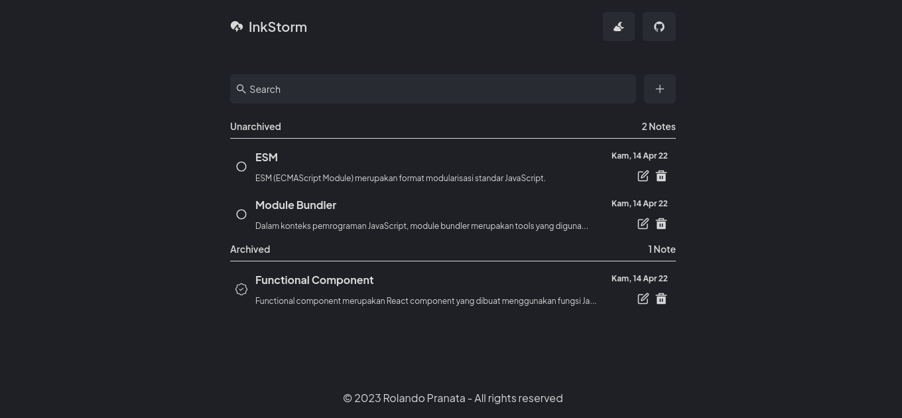

# [Ink Storm - Belajar Membuat Aplikasi Web Dengan React - IDCamp Scholarship Submission Project 2023](https://www.dicoding.com/academies/403/corridor)

[](https://ink-storm-idcamp.netlify.app/)

Welcome to the Ink Storm project! This application is part of my submission for the IDCamp scholarship in 2023. Ink Storm is a simple book management application designed to help beginners create web frontends using React. Whether you're new to web development or looking for a straightforward example project, Ink Storm is here to assist you.

## Table of Contents

- [Introduction](#introduction)
- [Features](#features)
- [Tech Stack](#tech-stack)
- [Getting Started](#getting-started)
- [Information](#information)

## Introduction

Ink Storm is a minimalistic web application that showcases the power of React for creating web frontends. It serves as an ideal starting point for beginners who want to learn the basics of web development or as a quick reference for those looking to brush up on their skills.

## Features

- 📘️ Create note
- 🔥️ Delete note
- 🔍️ Search note
- 🌖️ Dark mode
- 📝️ Edit note

## Tech Stack

- UI Framework - [**React**](https://reactjs.org/)
- Package Manager - [**Yarn**](https://yarnpkg.com/)
- Styling - [**TailwindCSS**](https://tailwindcss.com/)
- Fonts - [**Font Source**](https://fontsource.org/)
- Icons - [**React Icons**](https://react-icons.github.io/react-icons/)
- Deployment - [**Netlify**](https://www.netlify.com/)

## Getting Started

To get started with Read Easy, you can follow this step:

1. **Clone the Repository** You can clone this GitHub repository to your local machine using the following command:

   ```shell
   git clone https://github.com/your-username/ink-storm.git
   ```

2. **Running project**

Node.js version `>= 16.x` setup with [yarn](https://yarnpkg.com/) is recommended.

```bash
# install dependencies
yarn

# serve with hot reload at localhost:5173
yarn dev

# build for production
yarn build
```

## Information

This repository is a Dicoding submission for the Learning to Create React Application for Beginners class. This class has submissions that must be completed to earn a certificate. The contents of this repository are the final section that includes the required criteria.

> **_WARNING: Use this repo only as a reference._**
>
> - In accordance with the terms of use at Dicoding, Dicoding Academy class submissions must be your own work.
>
> - Code obtained from other sources (websites, books, forums, GitHub, etc.) is only used as a reference. The level of similarity cannot be more than 70%.

<br clear="both">
<br clear="both">

> If you have questions or issues, visit the following repository -> [new issue](https://github.com/rolandowebdev/ink-storm/issues/new)
> If this documentation is useful, let's be friends by pressing the follow button on this [profile](https://github.com/rolandowebdev) and star this [repository](https://github.com/rolandowebdev/ink-storm) 😁️

<br clear="both">

Big thanks for [Dicoding](https://www.dicoding.com/) and [Idcamp](https://idcamp.ioh.co.id/)🙌️

<br clear="both">

Thank you for checking out Ink Storm! Happy learning and coding! If you have any questions or encounter any issues, feel free to open an issue on this repository.
